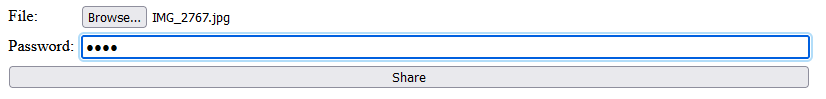
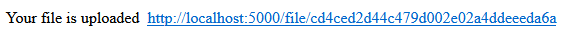
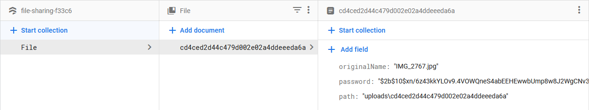
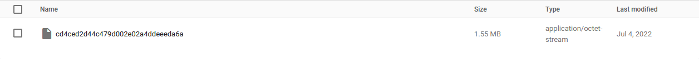
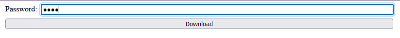

# File sharing

- The user uploads a file with the option to give it a password

- A randomly generated id is created poiting to that file

- The file data such as its original name, password (if applicable) and path are stored in firestore

- The file is uploaded to firebase storage with the same id as the document in firestore containing its data

- The user is able to download the file through the randomly generated link. The file and its accompanying data is then deleted from the database once downloaded.
