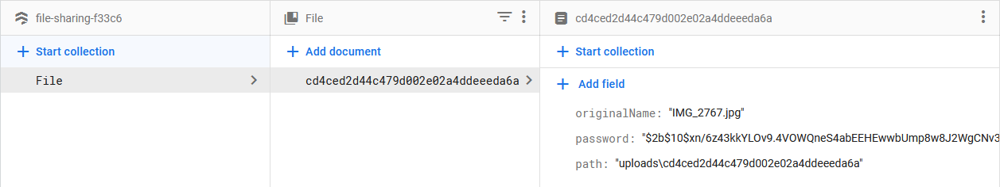
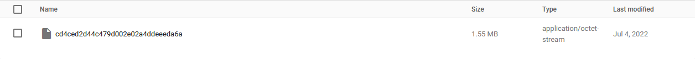

# File sharing

## How it works

https://barry-shares.herokuapp.com (link does not work until I find another provider to host my project, Heroku is not free anymore)


- The user uploads a file with the option to give it a password


- A randomly generated id is created poiting to that file



- The file data such as its original name, password (if applicable) and path are stored in firestore



- The file is uploaded to firebase storage with the same id as the document in firestore containing its data


- The user is able to download the file through the randomly generated link. The file and its accompanying data is then deleted from the database once downloaded

## How to run

- Create a **.env** file with the following format and fill in your firebase configuration variables

```
apiKey='YOUR_API_KEY'
authDomain='YOUR_AUTH_DOMAIN'
projectId='YOUR_PROJECT_ID'
storageBucket='YOUR_STORAGE_BUCKET'
messagingSenderId='YOUR_MESSAGING_SENDER_ID'
appId='YOUR_APP_ID'
```

- Download the needed dependencies

`npm install`

- Run the express server and open http://localhost:3000/

`npm run start`
